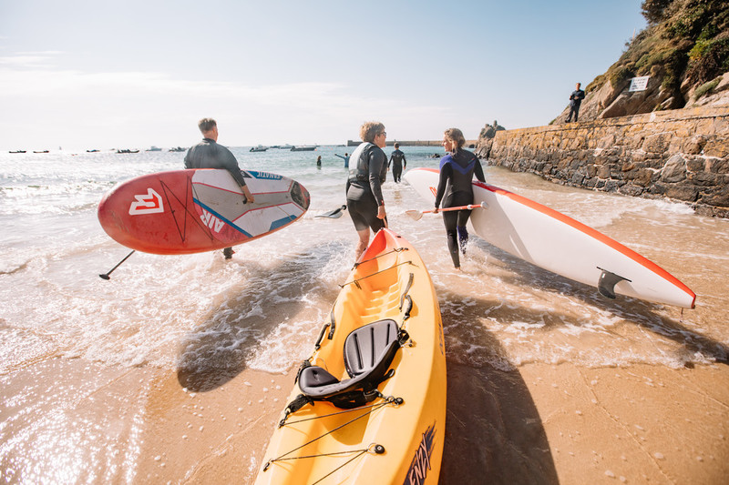

There is so much to see and do in Jersey, If I listed them all here this blog post would more so resemble a university essay. So I'm going to aim to share my absolute favourite spots and activities on the island for you to enjoy during your next trip to Jersey. 

There are many resources and lists on the web already, highlighting the mass of activities in Jersey. My absolute favourite is Channel Islands Direct's [40 things to do in Jersey](https://www.channelislandsdirect.co.uk/40-things-to-do-in-jersey), which covers almost everything you can do in the island in quick fire format. I'm going to highlight my three favourites, which you may have guessed it - all involve the sea! 

## Explore the coastline via Kayak

One of my absolute favourite things to do is hire a Kayak on St. Brelade's Bay and explore the coastline. There is nothing better than riding the waves and viewing the beautiful golden sands from the sea. You can hire kayak's from either [Absolute Adventures](https://www.absoluteadventures.je/activities/rentals), or [Jono's Watersports](http://www.jonoswatersports.com/). Prices start from £12 for half an hour. If you want to take things further, why not embark on a guided Kayak tour? Groups are usually family based and include some rock-climbing for the more adventurous of explorers! 

<iframe width="560" height="315" src="https://www.youtube.com/embed/zPTLNpS6cy0" title="YouTube video player" frameborder="0" allow="accelerometer; autoplay; clipboard-write; encrypted-media; gyroscope; picture-in-picture" allowfullscreen></iframe>

## Take a RIB boat to Les Écréhous

Taking a 6 mile RIB boat over to Jersey's best kept secret has to be the ultimate island adventure! 😍  From it's stunning sunsets/sunrise to the local habitat of bottlenose dolphins & atlantic grey seals, this place is special. [Jersey Seafaris](https://www.jerseyseafaris.com/ecrehous) offer chartered trips to Écréhous which start from £36.99 for 1.5 hour trip. 

<iframe width="560" height="315" src="https://www.youtube.com/embed/hkVuXWo_F_k" title="YouTube video player" frameborder="0" allow="accelerometer; autoplay; clipboard-write; encrypted-media; gyroscope; picture-in-picture" allowfullscreen></iframe>

## Try sea swimming! 

With the recent trends in wild and outdoor swimming, cold exposure and just general fun, Jersey is the ideal location to get involved and try outdoor swimming. Where-ever you are on the island, you're never more than 10 minutes from the sea, which provides so much variation to keep swimming on the island interesting. If you're a beginner, start at either St.Brelades Bay or Grève de Lecq where lifeguards can be found in the summer months. Experienced swimmers may want to try Plémont for a stunning swim surrounded by rugged cliffs. 

I guess you may have spotted the theme of my choices by now. It goes without saying, be careful in the sea and know your own limits. If you haven't booked your [Holiday to Jersey](https://www.channelislandsdirect.co.uk/jersey-holidays), I can recommend Channel Islands Direct who are based here on the island. 

Enjoy! 

